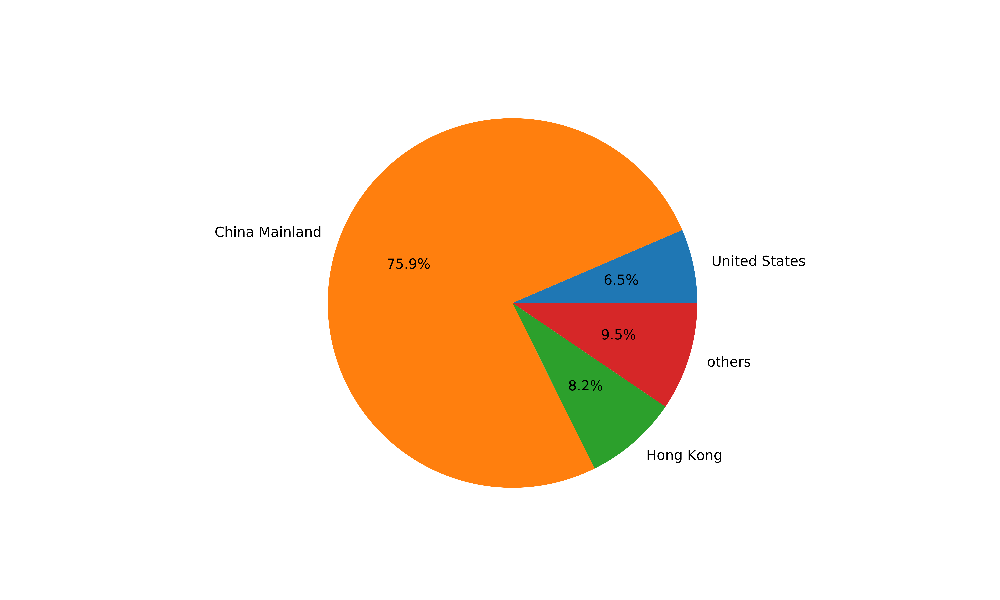
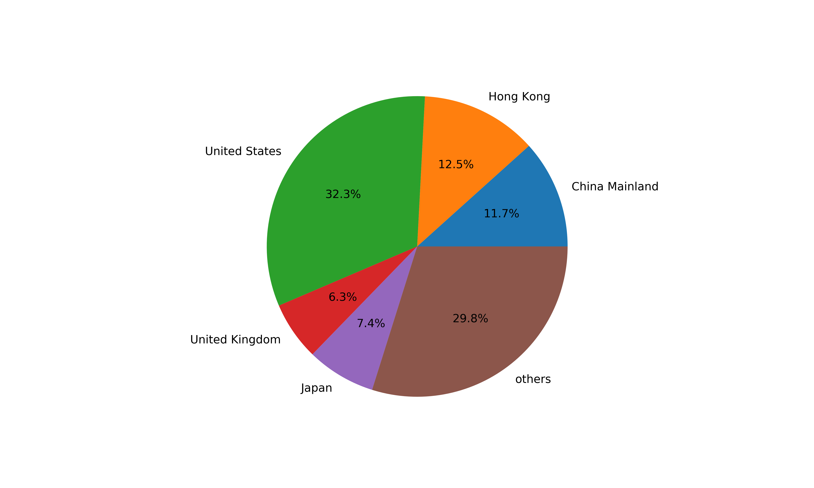

# Background
Most research related with movie reviews on public reviewing platforms always classify movies or decide their quality according to the overall rating. However, consider about internet marketers will influence overall rating by giving high or low score deliberately, we use star distribution as feature to cluster movies. Then we analyze movies in different groups, from movie information to comments information. Particularly, we focus on movies in intersections where movies in different groups but have the same overall scores, and analyze the common and the different. 
# Part of results
Visualization of clustering results by K-medoids.

## Pattern mining within each cluster
### Comments word cloud
Movies of b-shape star distribution:

movies of f-shape star distribution:

movies of L-shape star distribution:

movies of p-shape star distribution:

movies of v-shape star distribution:

### Type distribution
b-shape type distribution:

f-shape type distribution:

l-shape type distribution:

p-shape type distribution:

v-shape type distribution:

### Country distribution

b-shape country distribution:

f-shape country distribution:

l-shape country distribution:

p-shape country distribution:

v-shape country distribution:

## Pattern mining within interseciton
overall score distribution of movies in different star distribution groups

### Country distribution and type distribution

#### p-f intersection:
type comparison

country comparison

#### v-p intersection:
type comparison

country comparison

#### b-v intersection:
type comparison

country comparison
